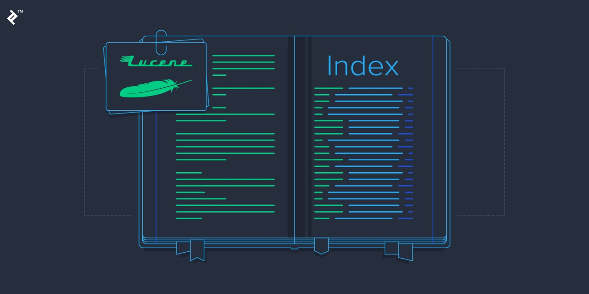
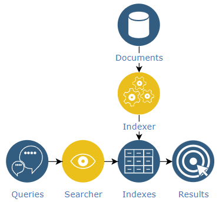
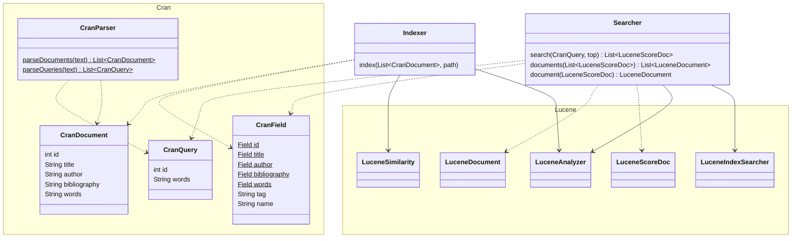

# *Lucene Cranfield* Search Engine

[](https://www.java.com)
[](https://maven.apache.org)


## Introduction



A [***Lucene***](https://lucene.apache.org/) demo for searching the *Cranfield* collection. It searches for each query in file `cran.qry` and displays the first two related documents in file `cran.all.1400`.

```console
The results for the query with ID 27: papers on shock-sound wave interaction .
    SCORE: 7.306487, DOCUMENT ID: 64, TITLE: unsteady oblique interaction of a shock wave with plane disturbances .
    SCORE: 6.157679, DOCUMENT ID: 291, TITLE: sweepback effects in the turbulent boundary-layer shock-wave interaction .

The results for the query with ID 29: material properties of photoelastic materials .
    SCORE: 4.421124, DOCUMENT ID: 405, TITLE: tables of thermal properties of gases .
    SCORE: 4.305917, DOCUMENT ID: 553, TITLE: ablation of glassy materials around blunt bodies of revolution .
```

The workflow is as follows.



## Getting Started

### Prerequisites

- Install [*Java*](https://www.java.com).
- Install [*Maven*](https://maven.apache.org).

### Building

```bash
mvn package
```

## Class Diagram



## License

Distributed under the *MIT License*. See `LICENSE` for more information.